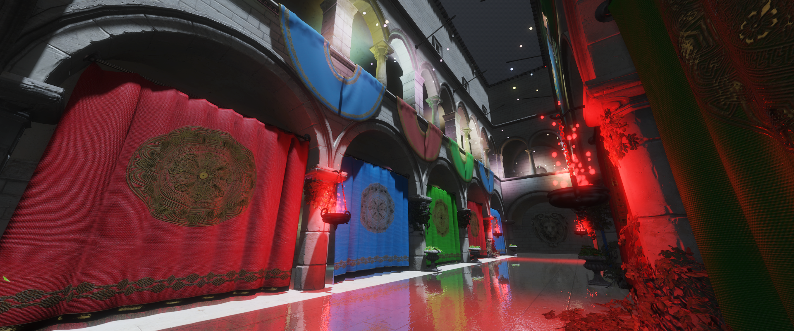

# WebGPU Sponza Demo

WebGPU tech demo showcasing various rendering techniques.

## About

A WebGPU deferred rendering playground written as a personal project to familiarize myself better with the API and explore various rendering techniques. As WebGPU is still considered experimental browser technology certain things might break for you.

## Features

1. glTF loading and parsing
2. Physically based shading
3. Cascaded shadow mapping (2 cascades)
4. Deferred Renderer (3 MRT) with culled light volumes using a stencil buffer
5. 400+ dynamic light sources moved in a compute shader
6. Separate forward pass for alpha masked objects (foliage)
7. SSAO
8. Screen Space Reflections with the ability to switch between Hi-Z and Linear raymarching
9. Physically based bloom
10. Temporal Anti-Aliasing (TAA)
11. UI controls to tweak various different rendering parameters
12. Dynamic performance degradation if the framerate dips below 60fps for longer than 2 seconds
13. Mobile support

## Requirements

WebGPU is still considered experimental technology and might not be implemented in the version of your browser of choice. Please refer to the [WebGPU Implementation Status](https://github.com/gpuweb/gpuweb/wiki/Implementation-Status) for more info.

## Dependencies

1. [@loaders.gl/gltf](https://www.npmjs.com/package/@loaders.gl/gltf) - Loading and parsing the glTF Sponza file
2. [webgpu-utils](https://www.npmjs.com/package/webgpu-utils) - Random useful things for WebGPU
3. [wgpu-matrix](https://github.com/greggman/wgpu-matrix) - Fast 3d math library for webgpu
4. [wgsl-preprocessor](https://github.com/toji/wgsl-preprocessor) - Adds simple preprocessor macros to your WGSL shader
5. [hdr.js](https://www.npmjs.com/package/hdr.js) - RGBE(.hdr) file reader/writer

## References and Readings

1. [WebGPU Shadow Playground](https://github.com/toji/webgpu-shadow-playground)
2. [WebGPU Clustered Forward Shading](https://github.com/toji/webgpu-clustered-shading/tree/main)
3. [SSAO](https://alextardif.com/SSAO.html)
4. [Screen Space Reflections: Implementation and optimization – HI-Z Tracing Method](https://sugulee.wordpress.com/2021/01/19/screen-space-reflections-implementation-and-optimization-part-2-hi-z-tracing-method/)
5. [Temporal Anti-Aliasing(TAA) Tutorial](https://sugulee.wordpress.com/2021/06/21/temporal-anti-aliasingtaa-tutorial/)
6. [Physically Based Bloom](https://learnopengl.com/Guest-Articles/2022/Phys.-Based-Bloom)
7. [Cascaded Shadow Mapping](https://learnopengl.com/Guest-Articles/2021/CSM)
8. [Satin - A 3D Graphics Framework built on Apple's Metal](https://github.com/Hi-Rez/Satin)

## Running Locally

1. Clone the repo locally
2. `npm i`
3. `npm run dev`
